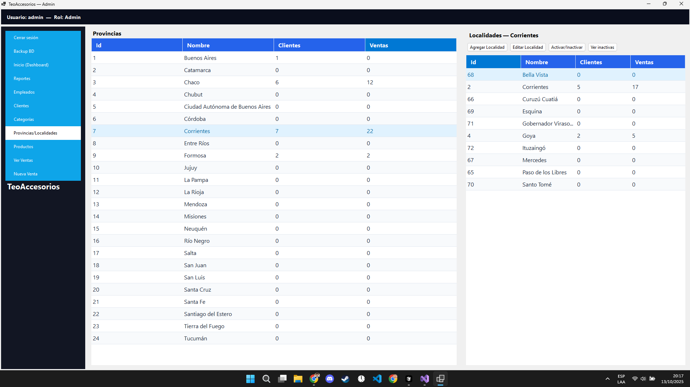
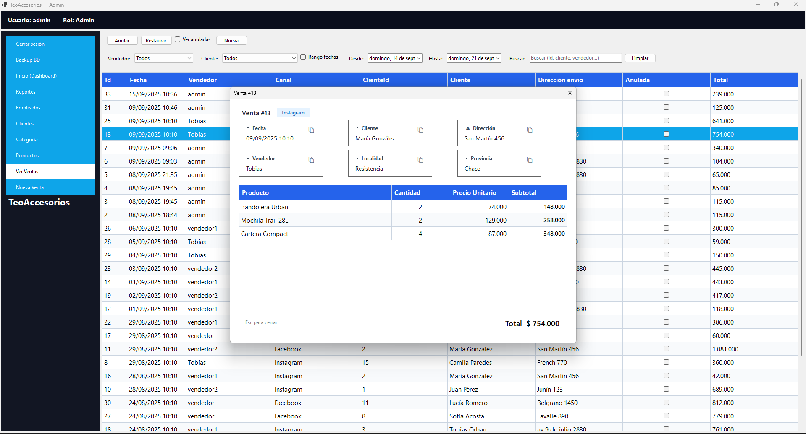

<p align="center">
  
</p>

<p align="center">
  
  
  
  
  
  
</p>

# TeoAccesorios — Desktop App (WinForms, .NET 8)

Aplicación de escritorio en **C# con WinForms** conectada a **SQL Server** para la gestión integral de una marroquinería.
Permite administrar clientes, productos, usuarios y ventas, ejecutar reportes con indicadores clave y automatizar tareas de soporte como exportaciones y backups. El proyecto se desarrolló como prototipo académico para la cátedra de **Laboratorio de Sistemas de Información (UNNE - FaCENA)**.

## Tabla de contenidos

1. [Características principales](#características-principales)
2. [Arquitectura y tecnologías](#arquitectura-y-tecnologías)
3. [Estructura del repositorio](#estructura-del-repositorio)
4. [Base de datos](#base-de-datos)
5. [Requisitos previos](#requisitos-previos)
6. [Configuración y ejecución](#configuración-y-ejecución)
7. [Flujo funcional](#flujo-funcional)
8. [Roles y permisos](#roles-y-permisos)
9. [Módulos de la aplicación](#módulos-de-la-aplicación)
10. [Reportes y exportaciones](#reportes-y-exportaciones)
11. [Utilidades para la operación](#utilidades-para-la-operación)
12. [Capturas](#capturas)
13. [Autores](#autores)

---

## Características principales

- Gestión unificada de clientes, productos, usuarios, localidades y ventas desde una misma aplicación.
- **Panel de control** con KPIs (ingresos, cantidad de ventas, clientes únicos, top de productos) y alertas visuales de stock bajo.
- **Workflows guiados** para ventas con búsquedas avanzadas de clientes/productos y cálculo automático de totales.
- Personalización de grillas (columnas visibles, orden, filtros) guardada por usuario.
- Exportación de reportes en **PDF** y **Excel (XLSX)** con layout corporativo.
- Soporte para **soft delete** y restauración de registros (clientes, productos, usuarios, ventas).
- Sistema de autenticación con contraseñas hasheadas y obligación de cambio cuando se detecta la contraseña por defecto.
- Herramientas auxiliares para backup manual de la base, gestión geográfica y panel de estadísticas dinámicas.

## Arquitectura y tecnologías

### Capas lógicas

- **Dominio (`Dominio/`)**: entidades de negocio tipadas (Cliente, Producto, Venta, Usuario, Provincia, etc.).
- **Datos (`Datos/`)**: acceso a SQL Server a través de un `Repository` centralizado con consultas parametrizadas y mapeo a modelos.
- **Infraestructura (`Infra/`)**: servicios transversales para autenticación, helpers de grillas y validaciones reutilizables.
- **UI (`UI/`)**: formularios WinForms organizados por módulo con componentes reutilizables en `Common/`.

### Tecnologías y dependencias

- **Framework**: .NET 8.0 (`net8.0-windows`) con soporte WinForms.
- **Base de datos**: SQL Server 2019+ con scripts de creación y datos de ejemplo.
- **Paquetes NuGet**:
  - `Microsoft.Data.SqlClient`: proveedor oficial SQL Server.
  - `QuestPDF`: render de reportes PDF.
  - `ClosedXML`: generación de planillas Excel.
  - `Microsoft.Web.WebView2`: incrustación de componentes web (charts y dashboards).
  - `Chart.js`: gráficos embebidos para módulos de estadísticas.
  - `Newtonsoft.Json`: serialización/deserialización auxiliar.

## Estructura del repositorio

```text
TeoAccesorios/
├── DataBase/                         # Scripts SQL (creación, migraciones, hashing de contraseñas)
├── TeoAccesorios.Desktop/
│   ├── Datos/                        # Db.cs, Repository central y consultas parametrizadas
│   ├── Dominio/                      # Entidades de negocio (POCOs)
│   ├── Infra/
│   │   ├── Auth/                     # Sesión, roles y helper de contraseñas
│   │   ├── Grid/                     # Helpers de DataGridView (persistencia de layout, locking)
│   │   └── Validation/               # Validaciones reutilizables para formularios
│   ├── Recursos/                     # Recursos y assets embebidos (RESX)
│   ├── UI/
│   │   ├── Common/                   # Login, MainForm, Dashboard, Reportes, utilidades compartidas
│   │   ├── Clientes/, Productos/, Usuarios/, Ventas/ ...
│   │   └── Estadisticas/             # Reportes gráficos y opciones de exportación
│   └── TeoAccesorios.Desktop.csproj  # Proyecto WinForms (.NET 8)
├── assets/                           # Capturas utilizadas en este README
└── README.md
```

## Base de datos

- Script principal: `DataBase/TeoAccesorios.sql` crea todo el esquema (tablas, vistas de compatibilidad, funciones) e inserta datos iniciales (categorías, productos, clientes, usuarios, ventas, localidades).
- Scripts complementarios (`hash-contraseñas.sql`, `migracion-provincias-localidades.sql`, etc.) permiten actualizar contraseñas, poblar localidades y mantener consistencia histórica.
- La tabla `Usuarios` almacena hashes SHA-256 (`dbo.HashPassword`) y define contraseñas por defecto por rol (`admin123`, `gerente123`, `vendedor123`).
- Cadena de conexión predeterminada en `Datos/Db.cs`:

  ```csharp
  public static readonly string ConnectionString =
      "Server=localhost;Database=TeoAccesorios;Trusted_Connection=True;Encrypt=True;TrustServerCertificate=True;";
  ```

  Ajustar `Server` y modo de autenticación según el entorno local/Institucional.

## Requisitos previos

- Windows 10/11 con .NET Desktop Runtime 8.0.
- Visual Studio 2022 (preferido) o SDK de .NET 8 para compilar desde CLI.
- SQL Server 2019 o superior (Express funciona) con permisos para crear bases y ejecutar scripts.
- Herramienta cliente para ejecutar scripts SQL (SQL Server Management Studio, Azure Data Studio, `sqlcmd`, etc.).

## Configuración y ejecución

1. **Clonar el repositorio**
   ```bash
   git clone https://github.com/tu-usuario/TeoAccesorios.git
   cd TeoAccesorios
   ```
2. **Provisionar la base de datos**
   - Abrir `DataBase/TeoAccesorios.sql` en SSMS/Azure Data Studio y ejecutarlo completo.
   - Ejecutar `DataBase/hash-contraseñas.sql` para migrar las contraseñas seed a hashes SHA-256 y establecer las claves por rol.
   - (Opcional) aplicar los scripts de migración adicionales para localidades si se parte de una BD previa.
3. **Configurar cadena de conexión**
   - Editar `TeoAccesorios.Desktop/Datos/Db.cs` si es necesario (servidor, autenticación SQL, etc.).
4. **Compilar**
   - Visual Studio: abrir `TeoAccesorios-Desktop.sln`, restaurar NuGet y compilar.
   - CLI: `dotnet restore TeoAccesorios.Desktop/TeoAccesorios.Desktop.csproj` seguido de `dotnet build`.
5. **Ejecutar**
   - Visual Studio: establecer `TeoAccesorios.Desktop` como proyecto de inicio y presionar `F5`.
   - CLI: `dotnet run --project TeoAccesorios.Desktop/TeoAccesorios.Desktop.csproj`.
6. **Credenciales de prueba**
   - `admin` / `admin123`
   - `gerente` / `gerente123`
   - `vendedor` / `vendedor123`

## Flujo funcional

1. **Login**: valida usuario en SQL Server y fuerza cambio de contraseña si detecta la clave por defecto.
2. **Dashboard**: muestra KPIs, ventas recientes, alertas de stock y accesos rápidos.
3. **Gestión**: ABM de clientes, productos, usuarios, localidades y provincias con soft delete/restauración.
4. **Ventas**: asistente para generar comprobantes, seleccionar clientes/productos por modales, calcular totales y generar PDF.
5. **Reportes & Estadísticas**: filtros de período, gráficos interactivos y exportaciones multi-formato.
6. **Utilidades**: backup manual de la base, administración de contraseñas y mantenimiento de catálogos.

## Roles y permisos

| Rol        | Alcance principal | Restricciones |
|------------|------------------|---------------|
| **Gerente**| Acceso total a todos los módulos: reportes/KPIs, administración de stock, clientes, ventas, usuarios y catálogos completos. | Ninguna, control total del sistema. |
| **Admin**  | Alta/baja/modificación de vendedores, productos y catálogos. Gestión de clientes y ventas. | No puede crear/editar usuarios con rol Admin o Gerente. No tiene acceso al módulo de estadísticas. |
| **Vendedor** | Generación y anulación de ventas propias, consulta de stock y clientes. | Acceso de solo lectura a catálogos; no puede ver reportes globales ni modificar usuarios. |

## Módulos de la aplicación

- **Login (`UI/Common/LoginForm.cs`)**: interfaz moderna, validaciones inmediatas, obliga cambio de contraseña.
- **Main / Dashboard (`UI/Common/MainForm.cs`, `DashboardForm.cs`)**: navegación lateral, cards de métricas, panel de ventas recientes.
- **Clientes (`UI/Clientes/`)**: altas/ediciones con validación de email, asignación de localidad y restauración de registros.
- **Productos (`UI/Productos/`)**: filtros por texto/categoría, control de stock mínimo, ABM completo y alertas de stock bajo.
- **Usuarios (`UI/Usuarios/`)**: administración de cuentas, reseteo de contraseñas, cambio obligatorio cuando detecta hash por defecto.
- **Ventas (`UI/Ventas/`)**: creación de comprobantes, selección de cliente/producto con modal, cálculo de totales y emisión PDF.
- **Reportes (`UI/Common/ReportesForm.cs`)**: vista tabular con filtros, exportación PDF/XLSX y métricas agregadas.
- **Estadísticas (`UI/Estadisticas/`)**: gráficos dinámicos (Chart.js + WebView2) y panel de exportación de configuraciones.
- **Localidades/Provincias (`UI/Provincias/`)**: mantenimiento de catálogos geográficos integrados con clientes.

## Reportes y exportaciones

- El módulo `ReportesForm` filtra las ventas desde el `Repository`, calcula KPIs (ingresos, clientes únicos, productos vendidos) y proyecta los datos en `_ventasFiltradas` para reutilizarlos en la UI y en las exportaciones.
- **Exportación a Excel:** el método `ExportExcelConResumen` crea un libro con resumen, detalle tabular, totales automáticos y hoja protegida mediante **ClosedXML**.
- **Exportación a PDF:** `ExportPdfConResumen` genera un documento con cabecera corporativa, totales y tabla formateada empleando **QuestPDF**.
- El diálogo de exportación permite seleccionar el formato final y reutiliza la misma colección filtrada, garantizando consistencia entre la grilla y los archivos generados.
- También se emiten comprobantes de venta en PDF listos para imprimir con logo corporativo y datos del cliente/productos.

## Utilidades para la operación

- **Backup manual** (`UI/Common/BackupForm.cs`): asistente con selección de ruta, compresión opcional, validación de integridad y registro detallado del proceso.
- **Grid Helper** (`Infra/Grid/GridHelper.cs`): persistencia de configuración de columnas por usuario y bloqueo de edición accidental.
- **Validaciones** (`Infra/Validation/FormValidator.cs`): reglas reutilizables para garantizar datos obligatorios antes de persistir.
- **PasswordHelper** (`Infra/Auth/PasswordHelper.cs`): hashing SHA-256 y verificación en tiempo constante.

---

## Capturas

### Login
<p align="center">
  
</p>

### Dashboard
<p align="center">
  
</p>

### Gestión de Clientes
<p align="center">
  
</p>

### Gestión de Productos
<p align="center">
  
</p>

### Gestión de Empleados (solo Admin)
<p align="center">
  
</p>

### Gestión de Localidades
<p align="center">
  
</p>

### Ventas
<p align="center">
  
</p>

### Venta Detalle
<p align="center">
  
</p>

### Nueva Venta
<p align="center">
  
</p>

### Reportes
<p align="center">
  
</p>

---

## Autores

<p align="center"><b>Proyecto desarrollado por Tobias Orban y Ivana Azcona (UNNE - FaCENA, 2025)</b></p>
