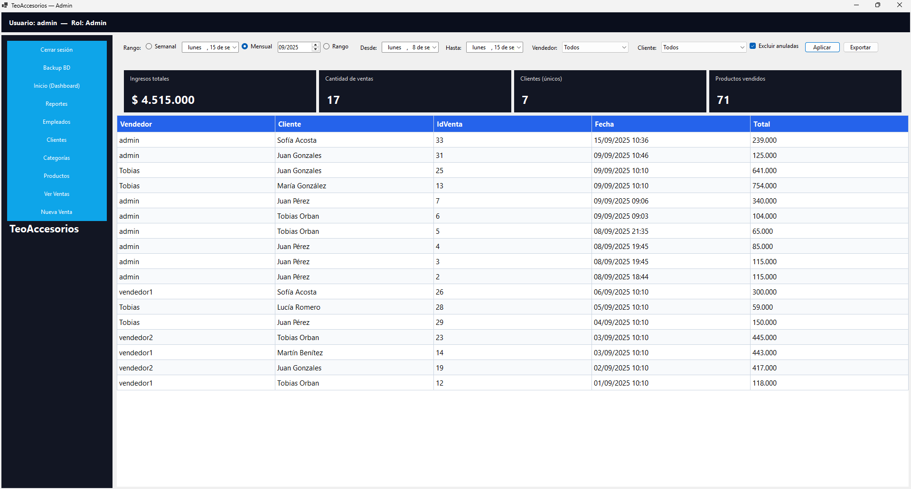

<p align="center">
  
</p>

<p align="center">
  
  
  
  
  
  
</p>

# TeoAccesorios — Desktop App (WinForms, .NET 8)

Aplicación de escritorio en **C# con WinForms** conectada a **SQL Server** para la gestión integral de una marroquinería. Permite administrar clientes, productos, usuarios y ventas, además de generar reportes con métricas clave. Este prototipo se desarrolló como proyecto académico para la cátedra de LSI (UNNE - FaCENA).

## Tabla de contenidos

1. [Características principales](#características-principales)
2. [Arquitectura y tecnologías](#arquitectura-y-tecnologías)
3. [Estructura del repositorio](#estructura-del-repositorio)
4. [Base de datos](#base-de-datos)
5. [Requisitos](#requisitos)
6. [Configuración y ejecución](#configuración-y-ejecución)
7. [Flujo de uso](#flujo-de-uso)
8. [Roles de usuario](#roles-de-usuario)
9. [Módulos disponibles](#módulos-disponibles)
10. [Exportación de reportes](#exportación-de-reportes)
11. [Capturas](#capturas)
12. [Autores](#autores)

---

## Características principales

- Gestión de clientes, productos, usuarios y ventas en una única interfaz.
- Reportes con KPIs (ingresos, ventas, clientes únicos y productos vendidos).
- Exportación de reportes en **CSV**, **TSV** y **JSON**.
- Roles diferenciados (**Administrador** y **Vendedor**) con permisos específicos.
- Interfaz en español con navegación desde un panel lateral.

## Arquitectura y tecnologías

- **Framework:** .NET 8.0
- **Interfaz:** WinForms
- **Lenguaje:** C#
- **IDE recomendado:** Visual Studio 2022
- **Base de datos:** SQL Server (base `TeoAccesorios` incluida en `DataBase/TeoAccesorios.sql`)
- **Patrón de acceso a datos:** `Repository` con consultas a tablas `cliente`, `usuario`, `categoria`, `subcategoria`, `producto`, `cabeceraventa` y `detalleventa`.

## Estructura del repositorio

```text
.
├─ TeoAccesorios.Desktop/        Código fuente de la aplicación WinForms
│  ├─ Models/                    Clases de dominio (Cliente, Producto, etc.)
│  ├─ Repository.cs              Acceso a datos basado en Db.Query/Exec
│  ├─ Db.cs                      Helper de conexión y ejecución SQL
│  ├─ *.cs/.resx                 Formularios (Login, Dashboard, Ventas, etc.)
│  └─ utilidades                 (GridHelper, FormValidator, …)
├─ DataBase/TeoAccesorios.sql    Script de creación + datos de ejemplo
├─ assets/                       Capturas usadas en la documentación
└─ TeoAccesorios-Desktop.sln     Solución de Visual Studio
```

## Base de datos

El archivo `DataBase/TeoAccesorios.sql` genera el esquema completo de SQL Server **y carga datos de ejemplo** para un arranque rápido. Contiene inserciones de categorías, clientes, usuarios, productos, ventas y sus detalles.

Ejemplo de datos precargados:

```sql
SET IDENTITY_INSERT [dbo].[Categorias] ON
INSERT [dbo].[Categorias] ([Id], [Nombre], [Descripcion], [Activo]) VALUES (1, N'Carteras', N'Carteras de cuero y eco cuero', 1)
...
SET IDENTITY_INSERT [dbo].[Clientes] ON
INSERT [dbo].[Clientes] ([Id], [Nombre], [Email], [Telefono], [Direccion], [Localidad], [Provincia], [Activo]) VALUES (1, N'Juan Pérez', N'juan@example.com', N'+54 9 379 555-1234', N'Junín 123', N'Corrientes', N'Corrientes', 1)

SET IDENTITY_INSERT [dbo].[Usuarios] ON
INSERT [dbo].[Usuarios] ([Id], [NombreUsuario], [Rol], [Activo], [correo], [contrasenia]) VALUES (1, N'admin', N'Admin', 1, N'', N'admin123')
```

La cadena de conexión por defecto se define en `Db.cs` y puede ajustarse según la instancia local:

```csharp
public static readonly string ConnectionString =
    "Server=localhost;Database=TeoAccesorios;Trusted_Connection=True;Encrypt=True;TrustServerCertificate=True;";
```

## Requisitos

- Windows 10 u 11
- [Visual Studio 2022](https://visualstudio.microsoft.com/vs/) con carga de trabajo **.NET Desktop Development**
- [.NET 8 SDK](https://dotnet.microsoft.com/download)
- Instancia de **SQL Server** con la base de datos `TeoAccesorios`

## Configuración y ejecución

1. Clonar el repositorio o descargar el ZIP.
2. Ejecutar `DataBase/TeoAccesorios.sql` para crear la base de datos local **con datos de ejemplo**. La cadena de conexión por defecto es `Server=localhost;Database=TeoAccesorios;Trusted_Connection=True;` y puede modificarse en `Db.cs`.
3. Abrir `TeoAccesorios-Desktop.sln` en **Visual Studio 2022**.
4. Compilar y ejecutar en modo **Debug** (`F5`).

## Flujo de uso

1. **Login:** la aplicación solicita credenciales. Como demo, acepta cualquier usuario y contraseña; escribir `Admin` o `Vendedor` para ingresar con ese rol.
2. **Dashboard:** presenta KPIs, últimas ventas y alertas de stock bajo.
3. **Gestión:** desde el menú lateral se accede a las secciones de clientes, productos, usuarios y ventas.
4. **Reportes:** se pueden filtrar períodos y exportar resultados en distintos formatos.

## Roles de usuario

### Administrador

- Gestiona clientes, productos y empleados.
- Accede a todos los reportes.
- Puede eliminar y restaurar registros.

### Vendedor

- Registra ventas y visualiza únicamente las propias.
- Puede anular/restaurar ventas del día.
- Tiene acceso de solo lectura a los productos.

## Módulos disponibles

- **Login:** validación inicial del usuario (demo).
- **Dashboard:** KPIs y resumen de actividad reciente.
- **Clientes:** altas, ediciones, eliminaciones y restauraciones.
- **Productos:** filtro por texto/categoría y ABM (solo Admin).
- **Usuarios/Empleados:** administración de cuentas (solo Admin).
- **Ventas:** creación de nuevas ventas, listado con detalles y anulación/restauración con reglas por rol.
- Exportación en  PDF y Excel.

---

## Exportación de reportes

La última iteración incorporó un **pipeline de exportación multi-formato** que reutiliza la misma proyección que alimenta la grilla de Reportes y la vuelca a distintos destinos según la necesidad del usuario.

### Formatos disponibles

- **PDF**  
  Se genera un documento con cabecera, período de análisis, tabla de ventas y totales.  
  Se utiliza la librería **QuestPDF**, que permite definir layouts declarativos, estilos consistentes y paginación automática.  
  La lógica está encapsulada en un `PdfReportExporter`, responsable de aplicar la tipografía, colores de encabezado y estructura de tabla.

- **Excel (XLSX)**  
  Se crea un `Workbook` mediante **ClosedXML**, una librería especializada en OpenXML.  
  El `ExcelReportExporter` se encarga de definir los tipos numéricos, aplicar formatos monetarios, resaltar la fila de totales y autoajustar columnas.  
  El archivo resultante queda listo para pivotar, graficar o aplicar filtros.

### Flujo técnico

1. El **`ReportService`** ejecuta la consulta LINQ y la proyecta en un objeto inmutable `ReportSnapshot`.  
2. Cada exportador implementa la interfaz **`IReportExporter`** y recibe el snapshot más la ruta de destino.  
3. Los exportadores delegan en las bibliotecas externas (QuestPDF / ClosedXML) para materializar el documento final, manteniendo el dominio desacoplado de dependencias de terceros.  
4. La **UI** invoca el exportador elegido desde el diálogo *Exportar*, y registra eventos de telemetría para trazabilidad.

### Dependencias externas

- **QuestPDF** → motor de composición de documentos PDF para .NET (distribuido vía NuGet, licencia compatible con uso académico).  
- **ClosedXML** → motor de manipulación de hojas de cálculo Excel en formato OpenXML.  

---

## Capturas

### Login
<p align="center">
  
</p>

### Dashboard
<p align="center">
  
</p>

### Gestión de Clientes
<p align="center">
  
</p>

### Gestión de Productos
<p align="center">
  
</p>

### Gestión de Empleados (solo Admin)
<p align="center">
  
</p>

### Ventas
<p align="center">
  
</p>

### Nueva Venta
<p align="center">
  
</p>

### Reportes
<p align="center">
  
</p>

---

## Autores

<p align="center"><b>Proyecto desarrollado por Tobias Orban y Ivana Azcona (UNNE - FaCENA, 2025)</b></p>

