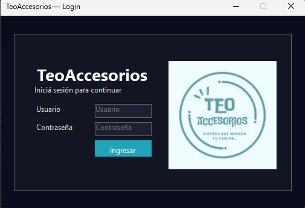

<p align="center">
  
</p>

<p align="center">
  
  
  
  
  
  
</p>

# TeoAccesorios — Desktop App (WinForms, .NET 8)

Aplicación de escritorio en **C# con WinForms** conectada a **SQL Server** para la gestión integral de una marroquinería. Permite administrar clientes, productos, usuarios y ventas, además de generar reportes con métricas clave. Este prototipo se desarrolló como proyecto académico para la cátedra de LSI (UNNE - FaCENA).

## Tabla de contenidos

1. [Características principales](#características-principales)
2. [Arquitectura y tecnologías](#arquitectura-y-tecnologías)
3. [Requisitos](#requisitos)
4. [Configuración y ejecución](#configuración-y-ejecución)
5. [Flujo de uso](#flujo-de-uso)
6. [Roles de usuario](#roles-de-usuario)
7. [Módulos disponibles](#módulos-disponibles)
8. [Capturas](#capturas)
9. [Estado actual y roadmap](#estado-actual-y-roadmap)
10. [Autores](#autores)

---

## Características principales

- Gestión de clientes, productos, usuarios y ventas en una única interfaz.
- Reportes con KPIs (ingresos, ventas, clientes únicos y productos vendidos).
- Exportación de reportes en **CSV**, **TSV** y **JSON**.
- Roles diferenciados (**Administrador** y **Vendedor**) con permisos específicos.
- Interfaz en español con navegación desde un panel lateral.

## Arquitectura y tecnologías

- **Framework:** .NET 8.0
- **Interfaz:** WinForms
- **Lenguaje:** C#
- **IDE recomendado:** Visual Studio 2022
- **Base de datos:** SQL Server (base `TeoAccesorios` incluida en `DataBase/TeoAccesorios.sql`)
- **Patrón de acceso a datos:** `Repository` con consultas a tablas `cliente`, `usuario`, `categoria`, `subcategoria`, `producto`, `cabeceraventa` y `detalleventa`.

## Requisitos

- Windows 10 u 11
- [Visual Studio 2022](https://visualstudio.microsoft.com/vs/) con carga de trabajo **.NET Desktop Development**
- [.NET 8 SDK](https://dotnet.microsoft.com/download)
- Instancia de **SQL Server** con la base de datos `TeoAccesorios`

## Configuración y ejecución

1. Clonar el repositorio o descargar el ZIP.
2. Ejecutar `DataBase/TeoAccesorios.sql` para crear la base de datos local (si aún no existe). La cadena de conexión por defecto es `Server=localhost;Database=TeoAccesorios;Trusted_Connection=True;` y puede modificarse en `Db.cs`.
3. Abrir `TeoAccesorios-Desktop.sln` en **Visual Studio 2022**.
4. Compilar y ejecutar en modo **Debug** (`F5`).

## Flujo de uso

1. **Login:** la aplicación solicita credenciales. Como demo, acepta cualquier usuario y contraseña; escribir `Admin` o `Vendedor` para ingresar con ese rol.
2. **Dashboard:** presenta KPIs, últimas ventas y alertas de stock bajo.
3. **Gestión:** desde el menú lateral se accede a las secciones de clientes, productos, usuarios y ventas.
4. **Reportes:** se pueden filtrar períodos y exportar resultados en distintos formatos.

## Roles de usuario

### Administrador

- Gestiona clientes, productos y empleados.
- Accede a todos los reportes.
- Puede eliminar y restaurar registros.

### Vendedor

- Registra ventas y visualiza únicamente las propias.
- Puede anular/restaurar ventas del día.
- Tiene acceso de solo lectura a los productos.

## Módulos disponibles

- **Login:** validación inicial del usuario (demo).
- **Dashboard:** KPIs y resumen de actividad reciente.
- **Clientes:** altas, ediciones, eliminaciones y restauraciones.
- **Productos:** filtro por texto/categoría y ABM (solo Admin).
- **Usuarios/Empleados:** administración de cuentas (solo Admin).
- **Ventas:** creación de nuevas ventas, listado con detalles y anulación/restauración con reglas por rol.
- **Reportes:** rango semanal, mensual o personalizado, con exportación en CSV/TSV/JSON.

## Capturas

### Login
<p align="center">
  
</p>

### Dashboard
<p align="center">
  
</p>

### Gestión de Clientes
<p align="center">
  
</p>

### Gestión de Productos
<p align="center">
  
</p>

### Gestión de Empleados (solo Admin)
<p align="center">
  
</p>

### Ventas
<p align="center">
  
</p>

### Nueva Venta
<p align="center">
  
</p>

### Reportes
<p align="center">
  
</p>

## Estado actual y roadmap

✔️ Pantallas funcionales en WinForms conectadas a SQL Server.
✔️ Navegación integrada en una sola ventana (sidebar fijo + panel central).
✔️ Roles diferenciados (Admin / Vendedor).

Para almacenar también la columna `Anulada` en `cabeceraventa`, ejecutar:

```sql
ALTER TABLE dbo.cabeceraventa ADD Anulada BIT NOT NULL DEFAULT 0;
```

## Autores

<p align="center"><b>Proyecto desarrollado por Tobias Orban y Ivana Azcona (UNNE - FaCENA, 2025)</b></p>

